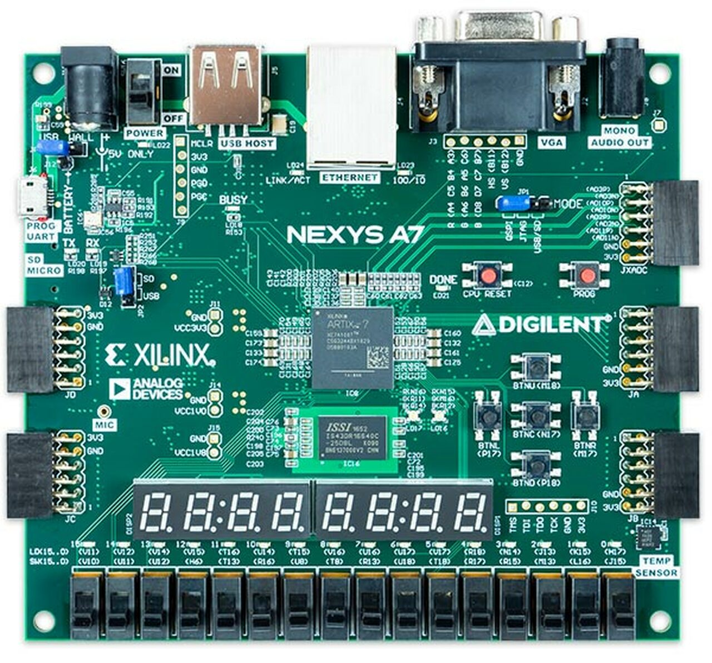

# General Matrix Multiplication (GEMM)

## About
The project was developed for course: `Computer Systems (Master's degree, FRI 2022)`

## About
C Synthesis of GEMM targeting `NexysA7 100t Board (Part: xc7acsg324-1)`
<figure>
<figcaption>NexysA7 100t Board</figcaption>

</figure>

## Usage
To generate test matrices: `python gemm.py <SIZE> <RANGE> <ALPHA> <BETA>` 